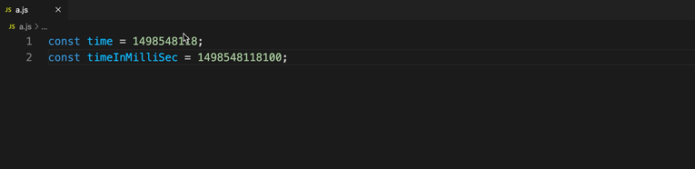

# Timestamp Helper Plus

Added some customization based on [Timestamp Helper](https://github.com/kovarxu/vscode-timestamp-helper) to make it a bit better to use.

Make it more convenient to manipulate timestamps. [中文版](./README_CN.md)

### Features

- Hover to display readable formatted time (the format can be specified by vscode configuration).
- guess second or millisecond automatically.
- provide some commands to add or alter timestamps.

The following enhancements are available:

- Support for hover display list customization
- Support customization of output timestamp unit

### Hover Display

Vscode configuration: `timestamp-helper-plus.format`, default to `YYYY-MM-DD HH:mm:ss`, get format patterns [here](https://dayjs.gitee.io/docs/en/display/format)

The following enhancements are available:

The list of timestamps can be customized in the configuration by `<name>:<time difference from UTC in seconds>`.

### Change Your Timestamp

* command: `transfer timestamp`
* keybinding: `alt+t alt+t`

The following enhancements are available:

- Default timestamp units can be set in the configuration

#### examples

* modify the timestamp in selections to 1 day, 5 hours and 3 minutes later: `1d5h3m later`
* insert a timestamp for a specified timing: `$2020-09-12T08:09:26` (The default timestamp unit for insertion is seconds, use `#` to change it to milliseconds, or set the default unit in the configuration)
* insert a timestamp for a specified UTC timing: `%2020-09-12T08:09:26`
* insert a timestamp 1 week and 5 hours ago from the current time: `1w5h ago from now`

#### format

* parts: `<prefix?><main> <adverbial?>`

prefix: `$`: output timestamp in second, `@`: output timestamp in millisecond, `%` the input timing is in UTC

main: [dayjs](https://dayjs.gitee.io/docs/en/parse/string) will be used to convert the main part to timestamp if no adverbial is provided. In this case, the main part should be an [ISO 8601](https://en.wikipedia.org/wiki/ISO_8601) string, such as `2019-08-12T15:03:22.010Z`. If any adverbial is provided then the main part is parsed as time offsets, which the format is continuous `number+unit`, such as `1Y2M1d4h` (1 year, 2 months, 1 day and 4 hours). The unit is an abbreviation of corresponding time unit: `Y` year，`M` month，`w` week，`d` day，`h` hour，`m` minute，`s` second，`S` millisecond.

adverbial: `after/later/ago/before`, may be followed by `from now`

* special words

`now`: the current time

`a few moments later`: a random time from now

